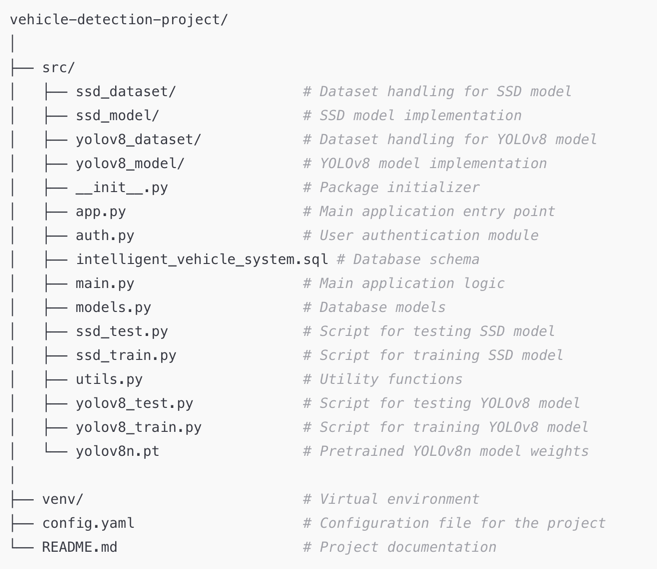
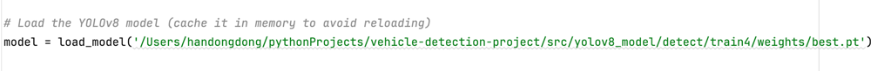

# Vehicle Detection Project

This project implements car and license plate detection using both SSD and YOLOv8 models. The project is structured to support dataset management, model training, testing, and evaluation, with separate implementations for SSD and YOLOv8 models.

## Project Structure


## Running the Application
1. **Install Dependencies**: Install the necessary libraries to run the project.
2. **Initialize the Database**: Execute database SQL: intelligent_vehicle_system.sql
3. **Configure the Project**: Change the model path on the app.py
   
4. **Run the Application**: Start the Flask web application to test the full system.
    ```bash
    python src/main.py
